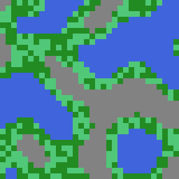
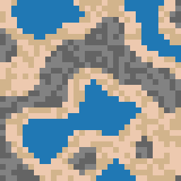

# Procedural Tilemap Generator Service

**FastAPI** microservice for procedural generation of 2D tilemaps with configurable biome rulesets, live-reload development, and multiple export formats.

---

## 🚀 Features (Current)

- **REST API Endpoints**
  - `POST  /generate_map/` → JSON tile‐grid
  - `GET   /generate_map/` → JSON via query params
  - `GET   /generate_map/png` → PNG image of the map
- **Biome Ruleset**
  - External `biomes.yaml` defines thresholds & tile variants
  - Throw 422 on unknown biome
- **Variability**
  - Each request produces a unique map via random noise offsets
- **Dockerized**
  - **Dev** image: live‐reload (`uvicorn --reload`), mounted code & config
  - **Prod** image: minimal, tests & dev tools excluded
- **Testing & Linting**
  - `pytest` for unit & integration tests (API, generator, biomes)
  - `flake8` + `isort` + **Black** for consistent style
- **CI/CD**
  - GitHub Actions runs tests, lint, builds both dev & prod images

---

## 🖼️ Example Maps

**16×16 (forest)**  

**32×32 (desert)**  

---
